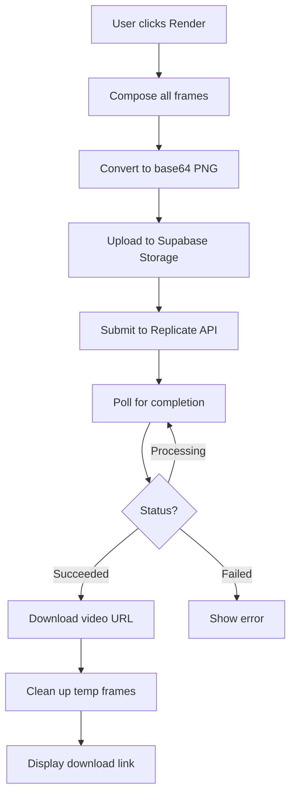

# Video Rendering Pipeline Documentation

## Overview

This document describes the complete rendering pipeline from frame extraction to final video output.

## Architecture

### 1. Frame Composition
- **Location**: `src/utils/frameCompositor.ts`
- **Purpose**: Compose frames with elements, effects, and camera transforms
- **Output**: Array of base64-encoded PNG images

### 2. Element Interpolation
- **Location**: `src/utils/frameTweening.ts`
- **Purpose**: Smooth interpolation between frames
- **Features**:
  - Position (x, y)
  - Scale (width, height)
  - Rotation (shortest path)
  - Opacity
  - Filters (blur, brightness, glow)
  - Motion blur (velocity-based)
  - Tracked positions support

### 3. Canvas Rendering
- **Location**: `src/components/FrameCanvas.tsx`
- **Purpose**: Real-time canvas rendering during editing and playback
- **Process**:
  1. Clear canvas
  2. Apply camera transforms (zoom, pan, dolly, rotate)
  3. Draw base frame (masked or original)
  4. Draw each element with transforms

### 4. Video Generation
- **Location**: `supabase/functions/render-video/index.ts`
- **Purpose**: Generate final video from composed frames
- **Technology**: Replicate API for video generation
- **Process**:
  1. Upload composed frames to Supabase Storage
  2. Submit frames to Replicate API
  3. Poll for completion
  4. Return video URL
  5. Clean up temporary frames

## Transform Pipeline

### Element Transform Properties
```typescript
{
  x: number;          // Position X
  y: number;          // Position Y
  width: number;      // Element width
  height: number;     // Element height
  rotation: number;   // Rotation in degrees
  opacity: number;    // 0-100
  blur: number;       // Blur amount in pixels
  brightness: number; // 100 = normal
  glow: number;       // Glow radius
  blendMode: string;  // Canvas composite operation
}
```

### Camera Transform Properties
```typescript
{
  zoom: number;   // Scale factor
  panX: number;   // Horizontal pan
  panY: number;   // Vertical pan
  rotate: number; // Rotation in degrees
  dolly: number;  // Depth (z-axis simulation)
}
```

## Critical Design Principles

### 1. Single Source of Truth
- Element transforms are stored in `elementsStore` and per-frame in `framesStore`
- All rendering pipelines read from these stores
- No separate coordinate systems for editor vs playback

### 2. Render Order
Always maintain this order:
1. Clear canvas
2. Apply camera transform
3. Draw base frame
4. Draw elements (sorted by z-index if needed)
5. Restore canvas state

### 3. Transform Consistency
- Editor mode: Uses DOM + transform CSS
- Playback mode: Uses canvas + ctx.transform()
- Both modes: Use identical x, y, width, height, rotation values

### 4. Interpolation Strategy
- All properties interpolate linearly with easing
- Rotation uses shortest-path interpolation
- Motion blur calculated from velocity
- Tracked positions override default interpolation

## Video Generation Flow



## Segmentation Integration

### Element Creation
When elements are separated from frames:
1. Segmentation returns bounding box: `{ x, y, w, h }`
2. Element created with bbox coordinates
3. Element position = bbox position (NOT centered or offset)
4. Element size = bbox size (NOT default size)

### Critical Fix
Previously, elements were being placed at (0,0) or centered, causing misalignment.
Now, elements maintain their segmentation bounding box coordinates throughout all pipelines.

## Performance Optimizations

1. **Frame Preloading**: Original frames preloaded into Image cache
2. **Async Image Loading**: All element images loaded asynchronously
3. **Canvas Reuse**: Single canvas element, cleared between renders
4. **Transform Batching**: Camera transforms applied once per frame
5. **WebGPU Acceleration**: Used when available for video encoding

## API Integration

### Replicate API
- **Endpoint**: `https://api.replicate.com/v1/predictions`
- **Authentication**: Bearer token from `REPLICATE_API_TOKEN`
- **Model**: Configurable video generation model
- **Input**: Array of frame URLs, FPS, format
- **Output**: Video URL

### Supabase Storage
- **Bucket**: `render-frames`
- **Access**: Public read for Replicate
- **Cleanup**: Temporary frames deleted after render
- **Retention**: Job results stored in `render_jobs` table

## Troubleshooting

### Elements appear at wrong position
- Check that segmentation bounding box is used correctly
- Verify no coordinate system conversions are happening
- Ensure camera transforms are applied before element drawing

### Interpolation only fading
- Verify all properties are being interpolated in `tweenElement()`
- Check that tweened elements are being passed to renderer
- Ensure tracked positions are being used when available

### Video generation fails
- Check Replicate API token is valid
- Verify frames uploaded to storage successfully
- Check Replicate model version is correct
- Monitor render_jobs table for error messages

### Black screen in playback
- Ensure base frame is drawn first
- Check frame image is loaded before rendering
- Verify camera transforms are not causing clipping
- Confirm canvas dimensions match frame dimensions
